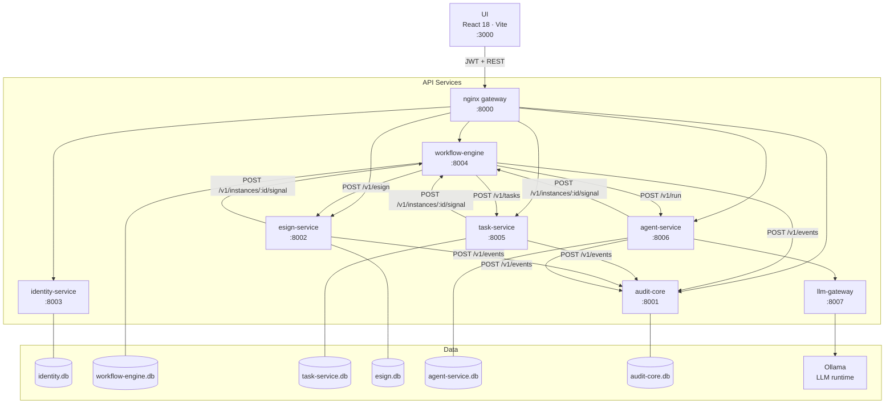
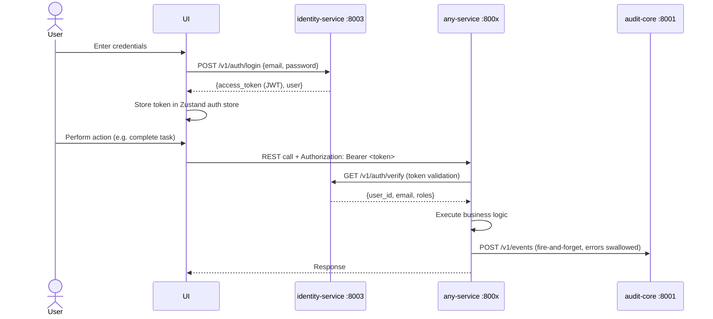
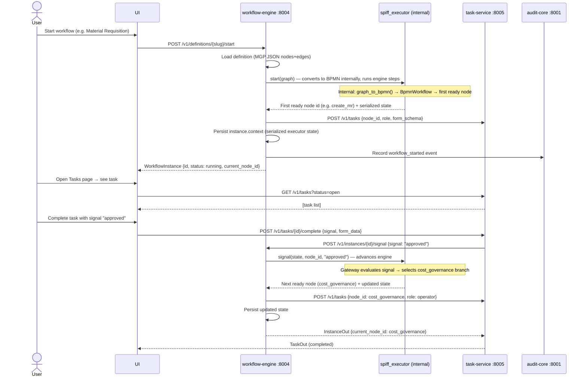
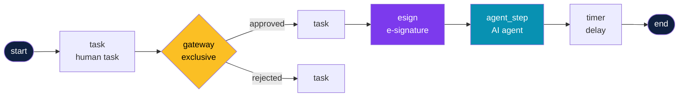
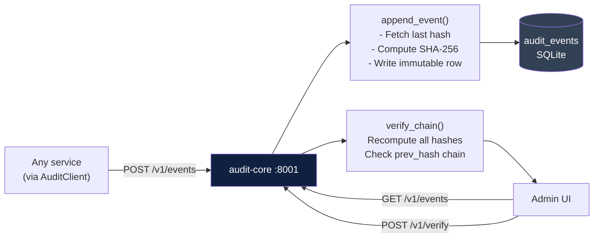
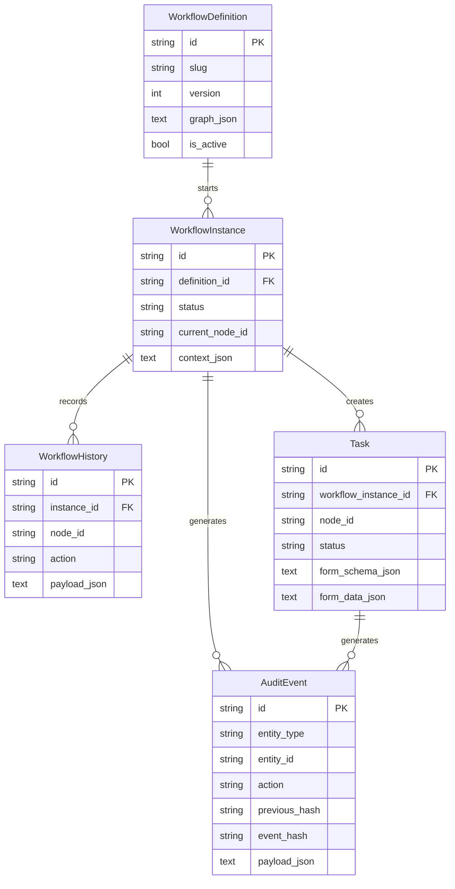
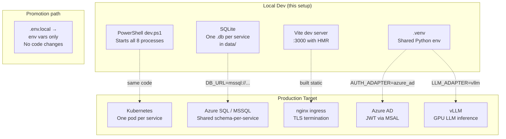

# MGP Platform — Architecture

Manufacturing Governance Platform (MGP) is a self-hosted, GxP-regulated workflow system that replaces Appian for Hexaware's manufacturing operations. It provides visual workflow design, human task management, AI-assisted governance (CAPA/RCA), electronic signatures, and an append-only audit trail.

---

## 1. Service Topology



---

## 2. Request / Auth Flow



---

## 3. Workflow Execution Flow

> **Source format:** MGP proprietary JSON (nodes + edges). BPMN 2.0 XML is an **internal** implementation detail used only inside `spiff_executor.py` — nothing outside the executor sees or produces BPMN.



---

## 4. Workflow Definition — Node Types

MGP workflow definitions are stored and exchanged as **JSON** with `nodes` and `edges` arrays. The Workflow Designer writes this format; `GET /v1/definitions/:id` returns it. Node types mirror Appian constructs plus two MGP-native extensions:



| MGP node type | Description | Key config fields |
|---|---|---|
| `start` | Entry point, one per graph | — |
| `end` | Terminal node | — |
| `task` | Human task assigned by role | `role`, `form_schema` |
| `gateway` | Exclusive branch on signal value | edge `condition` expressions |
| `agent_step` | AI agent node (agent-service) | `agent_type` |
| `esign` | Electronic signature (esign-service) | `signers`, `document_ref` |
| `timer` | Timed delay before next node | `delay_seconds` |

> The executor (`spiff_executor.py`) converts this JSON to BPMN 2.0 XML internally via `bpmn_converter.py`. This is a private implementation detail — the API and UI never see BPMN.

---

## 5. Agent Pipeline (AI-Assisted Nodes)

```mermaid
graph LR
    WF["workflow-engine\n(agent_step node entered)"]
    -->|POST /v1/run {agent_type, context}| AG["agent-service :8006"]
    AG -->|POST /v1/generate| LLM["llm-gateway :8007"]
    LLM -->|chat completion| OL["Ollama\n(local LLM)"]
    OL --> LLM
    LLM --> AG
    AG --> AG2["Parse + structure\nLLM response"]
    AG2 -->|POST /v1/instances/:id/signal| WF2["workflow-engine\n(advance to next node)"]

    style AG fill:#0891b2,color:#fff
    style LLM fill:#0369a1,color:#fff
    style OL fill:#64748b,color:#fff
```

---

## 6. Audit Chain (21 CFR Part 11)



Each `AuditEvent` row stores:
- `event_hash = SHA-256(id + entity + action + actor + payload + occurred_at + previous_hash)`
- `previous_hash` pointing to the preceding event

Any tampering (UPDATE/DELETE) breaks the chain and is detected by `verify_chain`.

---

## 7. Data Layer



---

## 8. Deployment Layers



**Key promotion env vars:**

| Variable | Local | Production |
|---|---|---|
| `DB_URL` | `sqlite+aiosqlite:///./data/...` | `mssql+aioodbc://...` |
| `AUTH_ADAPTER` | `stub` | `azure_ad` |
| `LLM_ADAPTER` | `ollama` | `vllm` |
| `AUDIT_CORE_URL` | `http://localhost:8001` | `http://audit-core.svc:8001` |
